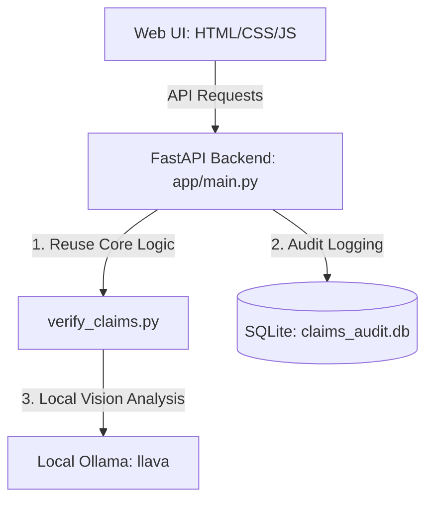

# Claim Verifier

A locally running insurance claim verification engine (car / laptop / package) using **Ollama** and the **Llava** vision model. It processes claim text + image files locally, and writes back a structured verdict for each claim (SUPPORTED / CONTRADICTED / INSUFFICIENT).

This system runs **100% locally** and requires **no external API keys** or internet connection once models are loaded.

## 1. Setup & Ollama Installation

### Install Ollama

1. Download and install Ollama from [ollama.com](https://ollama.com).
2. Once installed, start Ollama and pull the `llava` vision model from your terminal:
   ```bash
   ollama pull llava
   ```

### Project Setup

```bash
cd claim-verifier
python3 -m venv venv
source venv/bin/activate        # Windows: venv\Scripts\activate
pip install -r requirements.txt
```

### Environment Configuration

Copy the example file to `.env` (optional, default model is `llava`):

```bash
cp .env.example .env
# If you want to override the default local model:
# Edit .env and set: OLLAMA_MODEL=llava
```

---

## 2. Quick Demo (CLI Mode)

The repo includes a 10-claim demo under `claims/claims_demo.csv` mapped to generated local images under `images/test/...`. 

Ensure Ollama is running, then run:

```bash
python verify_claims.py \
  --claims claims/claims_demo.csv \
  --images-root . \
  --history claims/user_history.csv \
  --evidence-requirements claims/evidence_requirements.csv \
  --out output_demo.csv
```

Open `output_demo.csv` afterward to see the results.

---

## 3. Web Interface & FastAPI Backend

A modern, vision-powered Web UI and REST API have been added under the `app/` folder.

### Running the Backend

Start the local server using Uvicorn:

```bash
uvicorn app.main:app --reload
```

This starts the FastAPI server at `http://127.0.0.1:8000/`.

### Opening the Web UI

Simply open your web browser and navigate to:

```
http://127.0.0.1:8000/
```

From here you can:
1. **Verify Single Claims**: Select an object type, paste/type a claim conversation, upload images from disk, and trigger local AI claim verification.
2. **Run Batch Verification**: Input the path to a claims CSV file on the server and the images folder path. Submit to process all rows, which automatically logs them to SQLite and prompts a CSV download.
3. **Audit History & Logs**: View all past evaluations in a rich dashboard, dynamically filterable by Status and Object, with detailed modals.

---

## 4. Architecture Overview



1. **FastAPI Backend (`app/main.py`)**: Defines REST endpoints (`POST /verify-claim`, `POST /verify-batch`, `GET /claims`, `GET /claims/{id}`) and serves frontend static assets.
2. **SQLite Audit DB (`claims_audit.db`)**: Every verification result (from UI or batch runs) is saved locally in SQLite for a permanent audit trail.
3. **Core Reuse**: The API directly executes helper functions from the original `verify_claims.py` (e.g., image loading, prompting, result normalization) ensuring logic consistency.
4. **Unit/Integration Tests (`tests/`)**: Standard unit tests verify file loading and resolution. Mocked Ollama client tests verify correctness of `SUPPORTED`, `CONTRADICTED`, and `INSUFFICIENT` verdicts without calling the live Ollama daemon. Run tests with: `pytest tests/`.
